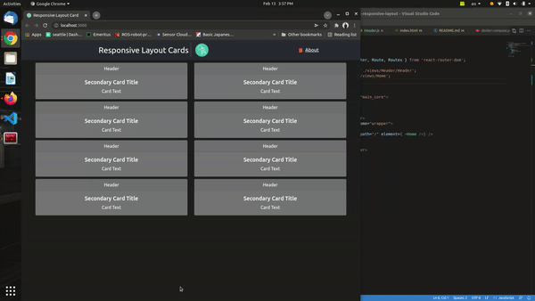
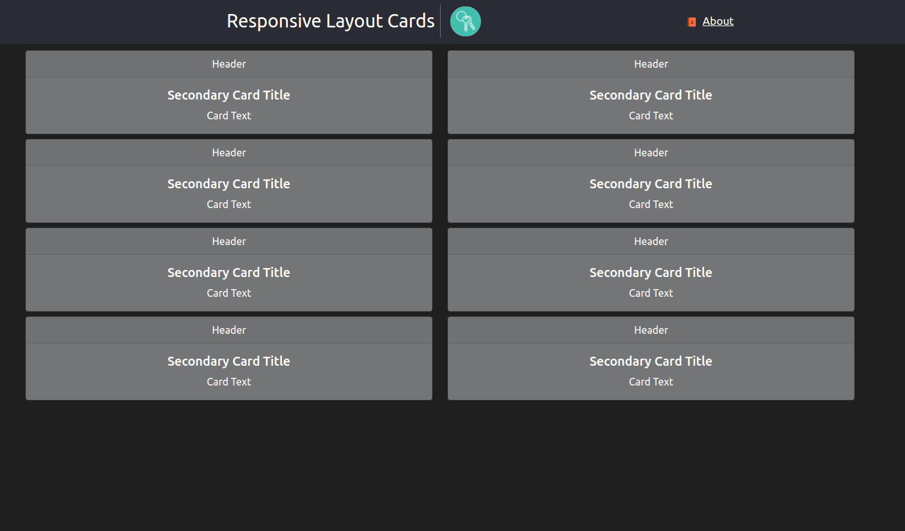

# React-js Responsive Card Mangement with Docker

# Author
    Nay Oo Kyaw
    nayookyaw.nok@gmail.com

# About
Bootstrap card responsive layout for all screen  
The data are loaded from a dynamic array  

# Demo

# Video Demo

# Method 1
   - go to project folder  
    
    $ npm install

    $ npm start

# Method 2 (with docker)
 - go to project folder  

    $ docker-compose build --no-cache

    $ docker-compose up

# See the result

go to - http://localhost:3000  

Result Link - 

Reference Links

https://github.com/attila/savvior
